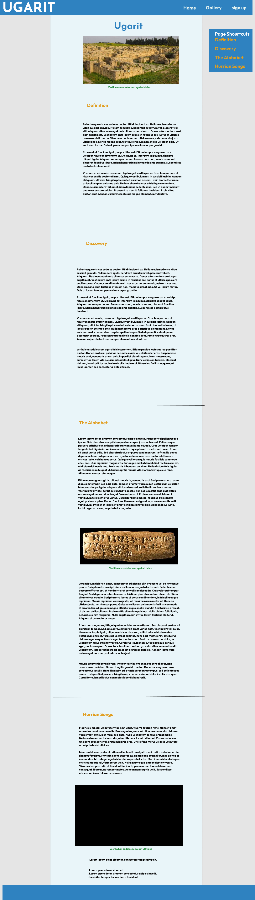
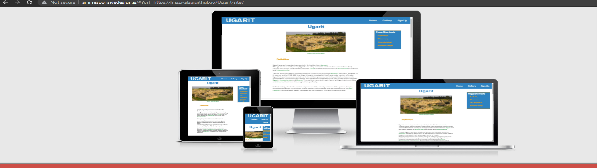
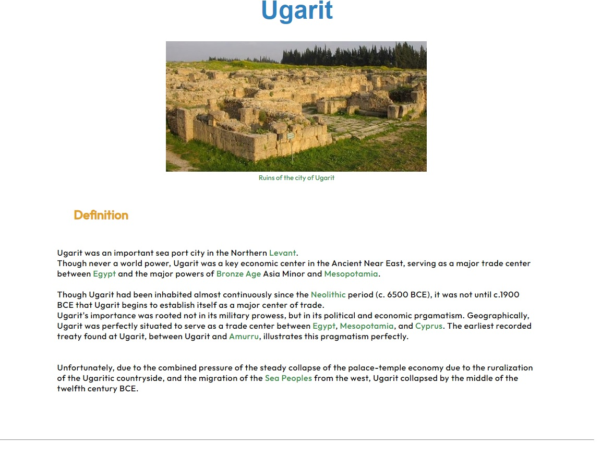
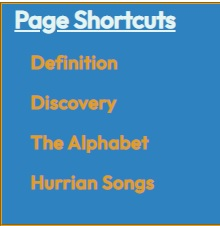
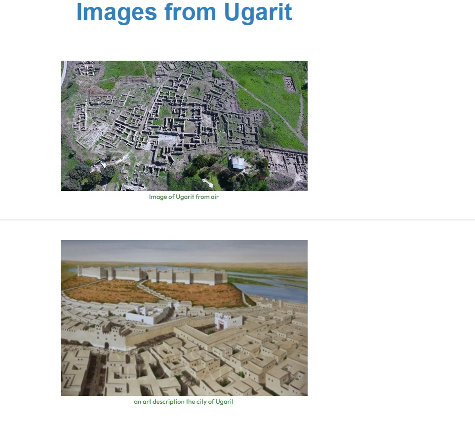
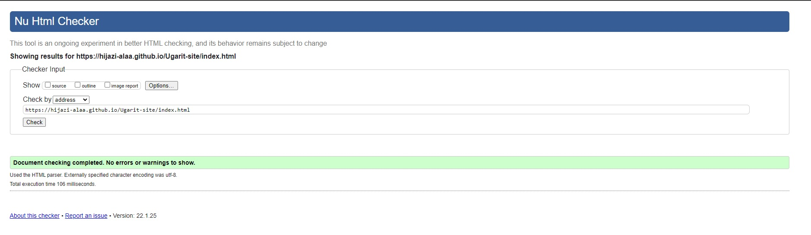
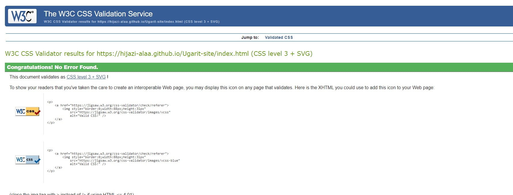
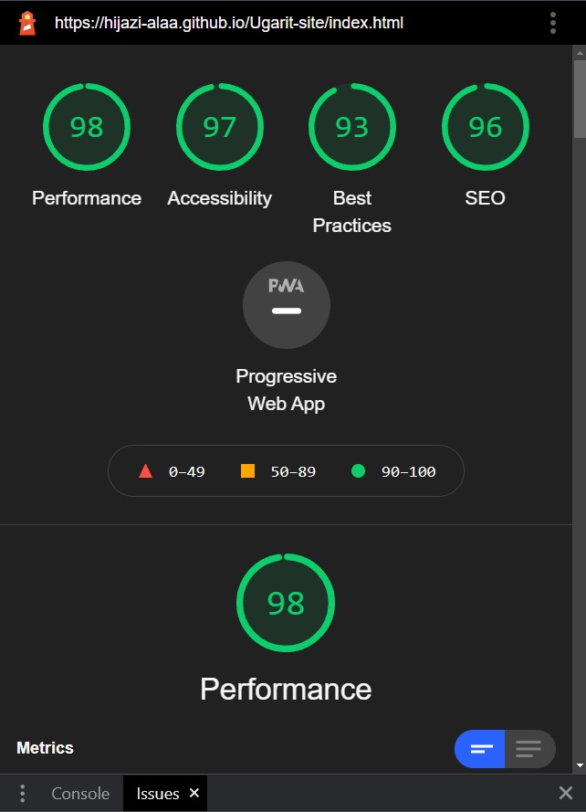
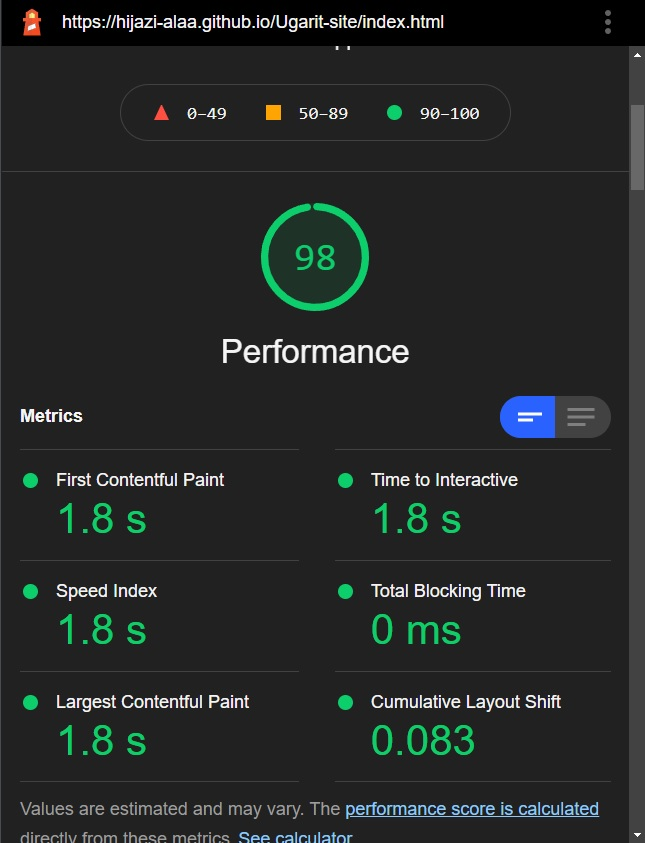

# Ugarit Website
[Ugarit](https://hijazi-alaa.github.io/Ugarit-site/index.html)

The Ugarit Site, is a historical site about the ancient city of Ugarit, surprisingly a lot of people have not heard of the city despite its huge contributions to our civilisation. In the site i attempt to introduce the city to as many people as possiable, or perhaps provide more detailed information for those who already know about Ugarit. the main sites objective is to have as much information as possiable about the city and its civilization all in one place, mainly to those who are interested in histoy in general, and bronze age civilizations in depth. but also to those who are curious about any of the content's avialable information!
the site also can become as a library of information about this historical subject.

I wanted to have as simple design that focus on the accessibility and easy to use, since the focus is the value of information as a whole
i used figma.com to create a mock up, wish looked like this:

  

  

## Ugarit was tested 
on [am i responsive](http://ami.responsivedesign.is/)
in addition also tested on all screen sizes using google dev tools. i  made the necessary adjustments by applying media query to css to ensure that the site is useable on all screen sizes
 

## Main features:

### Header

<li>Placed in a header  a logo at the left acting aslo as a button to the home page.</li>
<li>Navigation bar at the right side of the header with 3 buttons leading to Home, Gallery and sign up pages.</li>

### Article section

<li>Main image at the top of the article</li>
<li>Main content article wish is divided into 4 sections each with its own title</li>
<li>Provided external links to  the subjects that may not be known to all visitors, this way anyone could still be able to understand the information provided</li>
<li>An iframe element containing a youtube video to be played within the page or on youtube main site, and 3 extra external links to different virgion of the Hurrian song (first musical notation in history)</li>

### Footer

3 lists nested inside the footer containing:
<li>Links to sources that the information in the site are credited to</li>
<li>Other pages that users might find interesting about the same subject.</li>
<li>social media links presented with logos provided by fontawsome.com.</li>

### Shortcut navigation list

A floating aside element with fixed positioning that provides navigation buttons to make it easier for users to navigate between the 4 different sections within the main content of the home page.

### Gallery Page

A gallery page with several images nested within a figure element and provided with a figcaption to make it more accessible, and make it easier to add more images in the future.

### Sign Up Page

A sign up  page for users who wish to become members and receive emails from the Ugarit site. 

## Testing

Upon testing the html code on
[W3C Validator](https://validator.w3.org/)
, i encountered several error regarding closing tags in the some paragraphs
and others erros such as having heading elemnts within unorderd lists elements, wish i was able to fix.
so now testing with [W3C Validator](https://validator.w3.org/) is tottaly error free.

I also ran  the site on [Jigsaw](https://jigsaw.w3.org/css-validator/) and the resault was error free.

<li>Using the Lighthouse tool of google dev i got the following resaults:</li>

<li>I test the website on Google chrome, Internet exlorer, Safari for iphone, i had the same error free resaults on all of them</li>
<li>However upon running the website on Firefox there was unnecessary white space under the footer that i was not able to find the cause or the solution!(only on firefox)</li>

<li>I tried ever single external link all of them were working, except for the sources and other pages link in the footer, they were not appearing as clickable links at all andI could not find the exact problem, so i redid the html code for them and now they work fine just like the other links in the page</li>

## Deployment

The site is deployed on github pages by following these steps:

<li>In the github repository, navigated to the settings tab</li>
<li>In the settings tab navigated to the pages tab</li>
<li>Within the pages tab section click on the dropdown menu within source section and chose main </li>
<li>A new icon Appeared with the option to Save, when saved a link to the site appeared at the top of the pages section</li>

The Ugarit site link is here:
https://hijazi-alaa.github.io/Ugarit-site/

## Credits:

### Content

The main text of the home page is taken from as provided in sources in the footer of the page :
https://www.heritageforpeace.org/the-hymn-to-nikkal/

https://historyandarchaeologyonline.com/ugarit-and-the-origins-of-alphabet/

https://en.wikipedia.org/wiki/Ugaritic_texts

https://www.worldhistory.org/ugarit/

Social Media links logos used fontawsome.com

instructions on how to embed a youtube video from google support answers:
https://support.google.com/youtube/answer/171780?hl=en

Used guide on how to remove underline from a link in HTML since the guide provided by a question in stackoverflow:
https://stackoverflow.com/questions/10853881/how-to-remove-underline-from-a-link-in-html

-(i used the html and css essentials provided in Code institute LMS, to regather and remember alot of detaisl throughout the project)

### Media

Main content image, tourists in Ugarit ruins and image of the royal palace were all taken from wikipedia commons page:
https://commons.wikimedia.org/wiki/Category:Royal_Palace_of_Ugarit
and resized to fit the page.

Ugaritic Alphabet image was taken from :

https://sana.sy/en/?p=170139 the image was resized to fit the page.

Image of an art description the city of Ugarit taken from a

http://artecult.com/o-reino-de-ugarit/ the image was resized to fit the page

Image of an art description the royal palace in Ugarit was taken from

https://www.pinterest.com/pin/638033472191847970/ the image was reszied to fit the page

image of a letter written to the hittie king on an ugaritic tablet was taken from 
https://www.archaeology.org/issues/430-2107/features/9752-ugarit-bronze-age-archive  the image was resized to fit the page.
